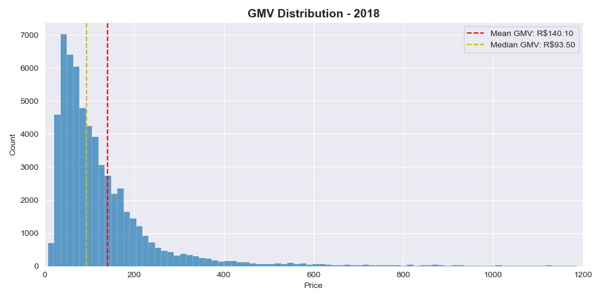
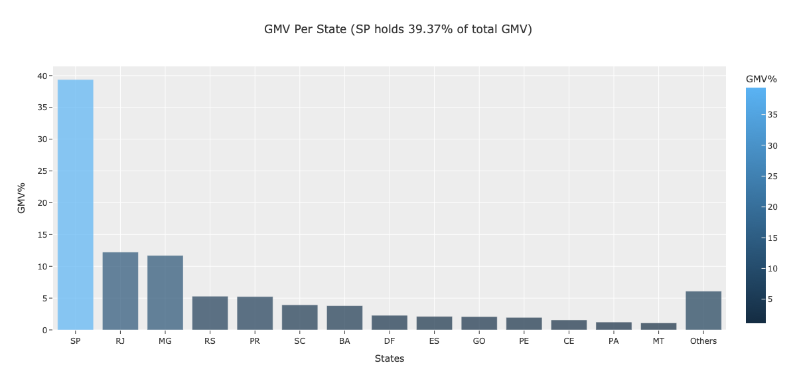
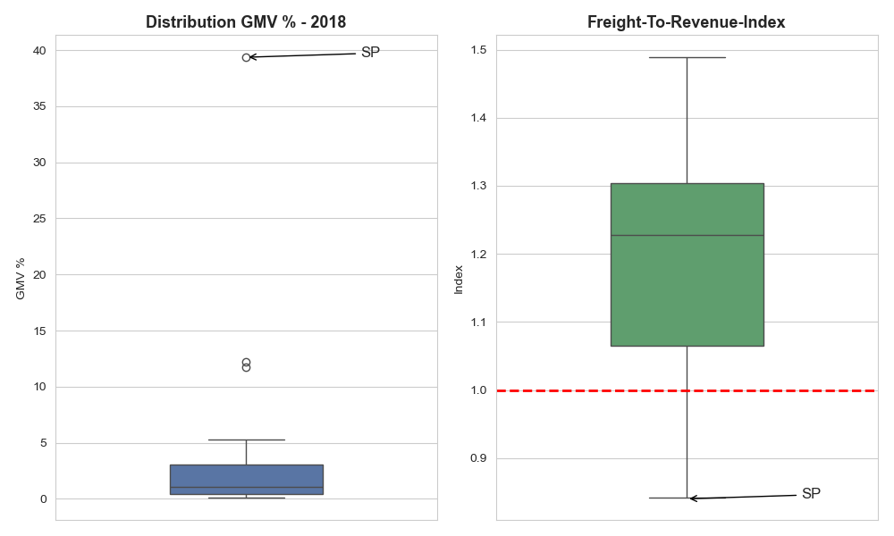
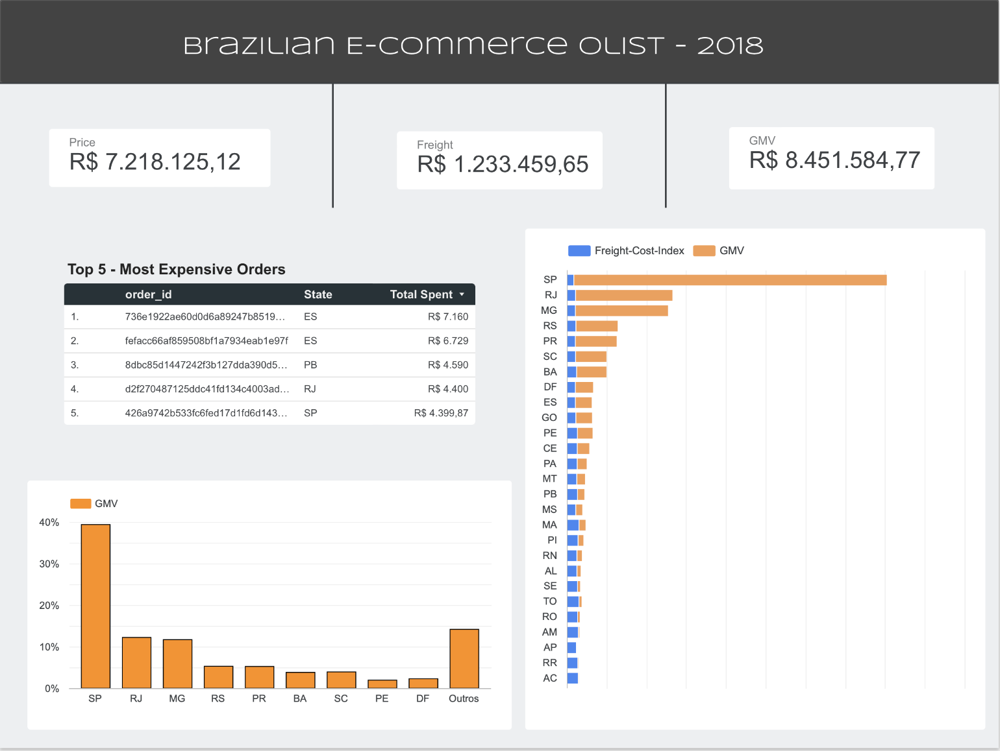
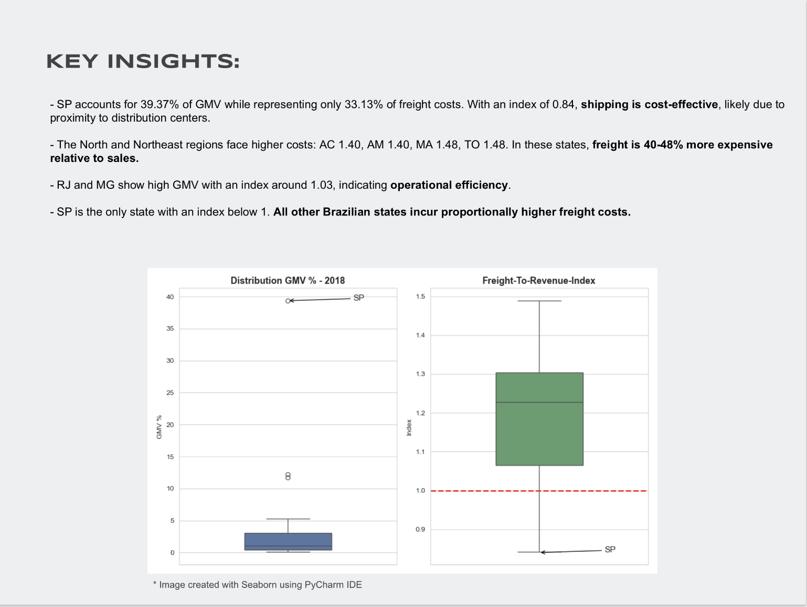

# 📊 Freight Cost vs GMV Analysis (Olist Dataset)

## 📌 Overview

This project analyzes the relationship between **freight cost and revenue (GMV)** using the Brazilian e-commerce dataset from Olist.

The main objective is to evaluate **operational efficiency across states** through a custom metric:

> **Freight Cost Index = Freight Value / GMV**

---

## 📂 Dataset

Data from Olist public dataset:

* Orders
* Order Items
* Customers
* Products

---

## ⚙️ Tech Stack

* Python (Pandas, Matplotlib, Seaborn, Plotly)
* Looker Studio (for dashboarding)

---

## 🔍 Data Preparation

* Merge orders + order items
* Filter:

  * Delivered orders
  * Year = 2018
* Join customer state
* Aggregate per order:

  * Price
  * Freight
* Create:

  * **GMV = price + freight**

---

## 📐 Key Metric

```
freight_cost_index = freight_value / GMV
```

### Interpretation:

* **< 1.0** → Efficient
* **= 1.0** → Break-even
* **> 1.0** → Inefficient

---

## 📊 Analysis

* GMV, Total Orders, Avg Ticket
* GMV distribution
* GMV share per state
* Freight vs GMV comparison
* Freight Cost Index per state

---

## 📈 Key Insights (2018)

* São Paulo (SP):

  * ~39% of total GMV
  * Freight Index ≈ **0.84**

* Only state clearly operating efficiently

* Other states:

  * Higher freight burden
  * Many close to or above break-even

> **Conclusion:**
> The operation is highly dependent on São Paulo performance.

---

## 📉 Data Visualization

### 1. GMV Distribution



---

### 2. GMV Share by State



---

### 3. Freight Cost Index vs GMV



---

## 📊 Looker Studio Dashboard

🔗 **Access the dashboard:**
[View on Looker Studio](https://datastudio.google.com/reporting/e857747b-06fb-4996-b670-d1cee6a3e4af)

---

### Dashboard Preview

#### 1. Overview Page



---

#### 2. Key Insights



---

## 🧠 Takeaway

A simple ratio like:

> **Freight / GMV**

can reveal hidden inefficiencies and regional imbalances that are not visible when looking at revenue alone.

---

## 📎 License

For portfolio and educational purposes.

